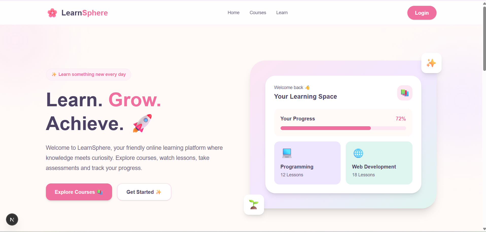
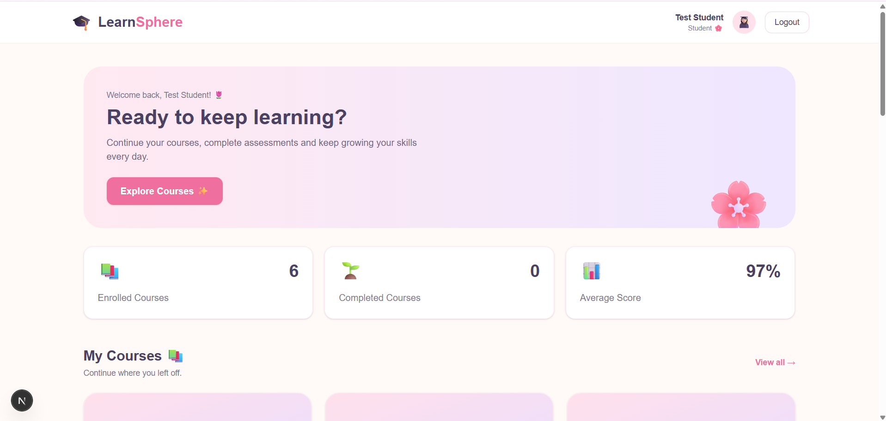

# 🎓 LearnSphere - Online Learning Management System

LearnSphere is a full-stack Online Learning Management System designed to provide a structured and interactive platform for online education.

The system supports students, instructors, and administrators with features such as course management, video-based learning, assessments, progress tracking, analytics, reviews, and role-based access control.

---

## ✨ Features

### 👩‍🎓 Student Module

- Student registration and login
- Browse available courses
- Search and filter courses
- Enroll in courses
- Access course modules and lessons
- Watch video lectures
- Mark lessons as completed
- Track course progress
- Attempt assessments
- View assessment results
- Submit course reviews and ratings
- View enrolled courses from the dashboard

### 👩‍🏫 Instructor Module

- Instructor authentication
- Create and manage courses
- Create course modules
- Add lessons and video content
- Create assessments
- Add assessment questions
- View course analytics
- Monitor student enrollment and progress
- View assessment performance

### 👑 Admin Module

- Admin authentication
- View platform statistics
- Manage users
- Manage user roles
- View all courses
- Publish/unpublish courses
- Delete courses
- View assessment statistics
- Monitor platform activity

---

## 🛠️ Technologies Used

### Frontend

- Next.js
- React
- TypeScript
- Tailwind CSS

### Backend

- Node.js
- Express.js
- REST API

### Database

- MongoDB Atlas
- Mongoose

### Authentication & Security

- JSON Web Tokens (JWT)
- bcryptjs
- Role-Based Access Control

### Development Tools

- Visual Studio Code
- Git
- GitHub
- Postman

### Deployment

- Render
- MongoDB Atlas

---

## 🏗️ System Architecture

```text
                    ┌──────────────────────┐
                    │      LearnSphere     │
                    │       Frontend       │
                    │   Next.js + React    │
                    └──────────┬───────────┘
                               │
                               │ REST API
                               ▼
                    ┌──────────────────────┐
                    │      Express.js      │
                    │       Backend       │
                    │      Node.js        │
                    └──────────┬───────────┘
                               │
              ┌────────────────┼────────────────┐
              │                │                │
              ▼                ▼                ▼
       Authentication    Course Management   Assessments
              │                │                │
              └────────────────┼────────────────┘
                               │
                               ▼
                    ┌──────────────────────┐
                    │     MongoDB Atlas     │
                    │       Database        │
                    └──────────────────────┘

## 📸 Screenshots
### 🏠 Landing Page

The LearnSphere landing page provides a clean and welcoming interface for discovering courses and accessing the learning platform.



### 🎓 Student Dashboard

The student dashboard provides an overview of enrolled courses, learning progress, assessment performance, and quick access to continue learning.

